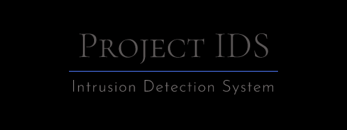

<p align="center">
  
  <p align="center">
	<a href=""></a>
  </p>
  <p align="center">
    <a href=""></a>
    <a href="https://github.com/projectIDS/Intrusion-Detection-System/"></a>
    <a href="http://www.python.org/download/"></a>
    <a href="https://www.gnu.org/licenses/gpl-3.0.en.html"></a>
	<a href=""></a>
  </p>
  <p align="center">
	<a href=""></a>
	<a href=""></a>
  </p>
</p>


# Project IDS - Intrusion Detection System
An Intrusion Detection System for detection and prevention of various types of Cyber attacks using deep learning technology.

## Introduction
ProjectIDS is an command line software which can be deployed on the server for detection and mitigation of cyber attacks. Project IDS is an integrated program which falls into category of Network Intrusion Detection System (NIDS) as well as Host-Based Intrusion Detection System(HIDS).It makes use of deep learning technology for finding the source of attacker and thus effectively mitigates the attack.

## Table of Content
* [General Info](#general-info)
* [Legal Disclaimer](#legal-disclaimer)
* [Requirements](#requirements)
* [Installation](#installation)
* [Supported Platforms](#supportedPlatforms)
* [Technologies](#technlogies)
* [Setup](#setup)
* [System](#system)
* [Usage](#usage)


## General info

**ProjectIDS** (short for **Project** [**I**]ntrusion [**D**]etection [**S**]ystem) is an automated and integrated tool that can be used for securing the servers from vaious types of cyber attacks . ProjectIDS uses deep learning technology and is simple to deploy and manage.

## Legal Disclaimer

**With each ProjectIDS run end users are obligated to agree** with the following prelude message:
```
(!) Legal disclaimer: 
It is the end user's responsibility to obey all applicable local, state and federal laws. 
Developers assume no liability and are not responsible for any misuse or damage caused by this program.
```

## Requirements

- **[Python](http://www.python.org/download/)** version **2.x 3.x**  are required for running this program.
- **[Wireshark](https://www.wireshark.org)** required for network traffic analysis
- **[Tensorflow](https://www.tensorflow.org)** required for Deep Learning 
- **[Pandas](https://pypi.org/project/pandas-ml/)** required for Deep Learing
- **[Keras](https://keras.io/)** required for Deep Learning


## Installation

Download ProjectIDS by cloning the Git repository:

    git clone https://github.com/projectIDS/Intrusion-Detection-System.git
    
## Supported Platforms

- Linux
- Support for other platforms in development

## Technologies

Project is created with:
* **[gcc 9.2.1 20200110](https://gcc.gnu.org/)**
* **[libpcap](https://www.tcpdump.org/)**
* **[GLib 2.62.4](https://developer.gnome.org/glib/)**
* **[zlib 1.2.11](https://www.zlib.net/)**
* **[dumpcap 3.2.1](https://www.wireshark.org/docs/man-pages/dumpcap.html)**
* **[tshark 3.2.1](https://tshark.dev/setup/install/)**
* **[Python 2](https://www.python.org/download/releases/2.0/)**
* **[Python 3](https://www.python.org/downloads/)**
* **[Tensorflow](https://www.tensorflow.org)**
* **[Keras](https://keras.io/)**
* **[Pandas](https://pypi.org/project/pandas-ml/)**
* **[POSIX capabilities (Linux)](https://en.wikipedia.org/wiki/POSIX)**
* **[libnl 3.](https://www.infradead.org/~tgr/libnl/)**


## Setup
To run this project, install it locally:

```
$ cd Intrusion-Detection-System
$ chmod 744 makeInstall.sh
$ ./makeInstall.sh
$ chmod 744 ids.sh
```


## System

**Project IDS is tested on system with following capapbilities**
Running on Linux 5.4.0-kali4-amd64, with Intel(R) Core(TM) i5-7200U CPU @2.50GHz (with SSE4.2), with 7924 MB of physical memory, with locale en_IN, with libpcap version 1.9.1 (with TPACKET_V3), with GnuTLS 3.6.12, with Gcrypt 1.8.5, with brotli 1.0.7, with zlib 1.2.11, binary plugins supported (0 loaded).


## Usage

To deploy the ProjectIDS:

```
$ cd Intrusion-Detection-System
$ ./ids.sh
```
